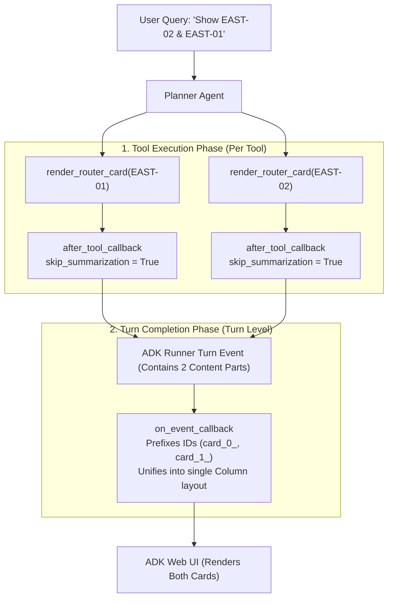

# A2UI Plugin (`a2ui_plugin.py`)

## Overview

The `A2UIPlugin` is an ADK (Agent Development Kit) plugin that enables interactive **A2UI v0.8 Declarative JSON** rendering and Base64 image artifact management in chat messages.

It intercepts tool outputs from agents (e.g. MCP router tools) and performs two critical functions:
1. **Bypasses LLM Summarization Latency**: Sets `tool_context.actions.skip_summarization = True` so the agent passes raw UI declarative operations directly to the frontend without paying the latency or hallucination cost of the LLM relaying JSON.
2. **Multi-Card Surface & ID Unification**: Consolidates parallel tool calls in the same turn into a single unified A2UI surface with scoped component IDs, preventing UI rendering conflicts and surface overwrites.

---

## The ADK Execution Lifecycle

When a user query triggers one or more A2UI tools (e.g. *"Show RTR-CAN-EAST-02 and RTR-CAN-EAST-01"*), execution proceeds through two ADK callback phases:



---

## Why Multi-Card Rendering Required Unification

When multiple tools render cards in the same turn, naive string concatenation fails due to two A2UI frontend constraints:

### 1. Surface Overwriting (`beginRendering`)
- **Problem**: Each tool returns a `beginRendering` operation with its own `surfaceId`. When the frontend receives two `beginRendering` operations in one chat message, the second surface replaces/destroys the first in the DOM container.
- **Solution**: `on_event_callback` combines all operations under a single `surfaceId: "unified-router-cards"`.

### 2. Component ID Collisions
- **Problem**: MCP server tools often generate cards with hardcoded component IDs (`id: "card-root"`, `id: "main-column"`, `id: "header-row"`, `id: "status-bar"`, etc.). If two card payloads are merged as-is, the second card's component definitions overwrite the first card's components in the UI state tree.
- **Solution**: `on_event_callback` prefixes all component IDs and child references by card index (`card_0_card-root`, `card_1_card-root`, etc.).

---

## Multi-Card Transformation Details

### Input: Two Separate Tool Outputs
**Tool 1 Output (`EAST-01`)**:
```json
[
  { "beginRendering": { "surfaceId": "surface-01", "root": "card-root" } },
  { "surfaceUpdate": { "surfaceId": "surface-01", "components": [ { "id": "card-root", "component": { "Card": { "child": "main-col" } } } ] } }
]
```

**Tool 2 Output (`EAST-02`)**:
```json
[
  { "beginRendering": { "surfaceId": "surface-02", "root": "card-root" } },
  { "surfaceUpdate": { "surfaceId": "surface-02", "components": [ { "id": "card-root", "component": { "Card": { "child": "main-col" } } } ] } }
]
```

### Output: Single Unified Surface & Layout
`on_event_callback` transforms the inputs into:

```json
[
  {
    "beginRendering": {
      "surfaceId": "unified-router-cards",
      "root": "multi-card-root"
    }
  },
  {
    "surfaceUpdate": {
      "surfaceId": "unified-router-cards",
      "components": [
        {
          "id": "multi-card-root",
          "component": {
            "Column": {
              "children": {
                "explicitList": [
                  "card_0_card-root",
                  "card_1_card-root"
                ]
              },
              "style": { "gap": "16px", "margin": "0px", "padding": "0px" }
            }
          }
        },
        {
          "id": "card_0_card-root",
          "component": { "Card": { "child": "card_0_main-col" } }
        },
        {
          "id": "card_1_card-root",
          "component": { "Card": { "child": "card_1_main-col" } }
        }
      ]
    }
  }
]
```

---

## Method Responsibilities

| Method | Trigger Point | Responsibility |
|---|---|---|
| `after_tool_callback` | Immediately after each individual tool finishes | Inspects tool result. If A2UI JSON is found, enables `skip_summarization = True` and returns clean `<a2ui-json>` block. If PNG is found, decodes Base64 and saves session artifact. |
| `on_event_callback` | After all tools in a turn complete | Collects all `<a2ui-json>` blocks in `event.content.parts`. For 1 card, passes it through. For $\ge 2$ cards, scopes component IDs, creates a parent `Column`, and outputs 1 unified `<a2ui-json>` block. |
| `intercept_image_artifact` | Called from `after_tool_callback` | Extracts Base64 PNG, saves it to the session artifact store via `tool_context.save_artifact`, and returns an `<a2ui-json>` block wrapping an A2UI `Image` component with `skip_summarization = True`. |

---

## Plugin Registration

To use `A2UIPlugin`, register it in `app/agent.py`:

```python
from app.plugins.a2ui_plugin import A2UIPlugin
from google.adk.apps.app import App

a2ui_plugin = A2UIPlugin()
app = App(root_agent=root_agent, name="app", plugins=[a2ui_plugin])
```
