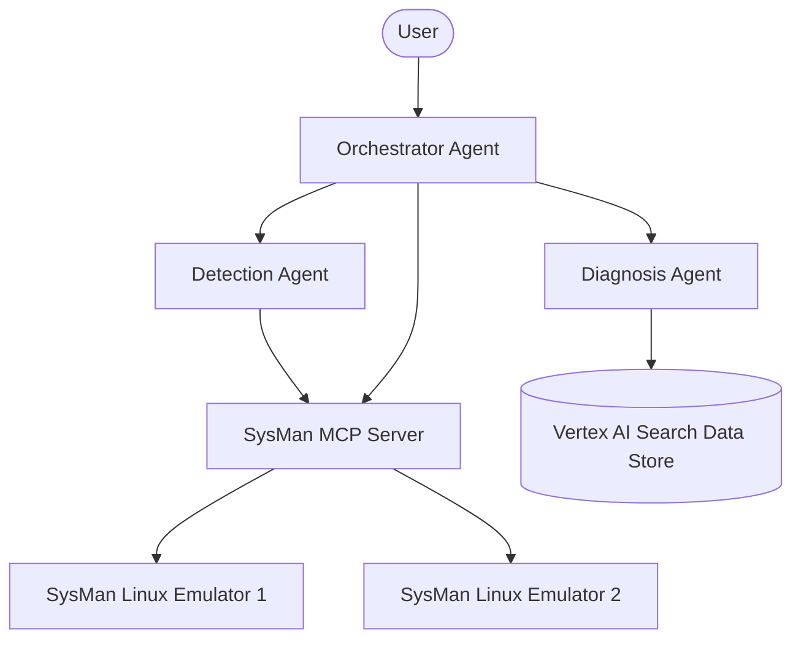

# Implementation Plan: System Management (SysMan) Exemplar of Telco's Architecture

This document provides a detailed technical implementation plan to build a complete system management emulator, MCP server, and agent orchestration suite matching Telco's architecture principles under the `~/dev/adk-lab-app/` workspace. All directories created will be prefixed with `sysman-`.

---

## 🏗️ Architectural Component Overview

We will implement three decoupled services under `~/dev/adk-lab-app/`:
1. **`sysman-emulator`**: A lightweight Python Flask web app emulating a Linux server's behavior, tracking telemetry, generating raw Prometheus metrics, executing system-level actions (e.g. systemd restarts), and simulating anomalies (such as `node_exporter` failure).
2. **`sysman-mcp-server`**: A Model Context Protocol (MCP) server running FastMCP that connects to the emulators, exposing high-level tools to fetch telemetry, execute controls, query syslog entries, and render interactive A2UI layout cards.
3. **`sysman-ops-agent`**: An Agent Development Kit (ADK) multi-agent application coordinating three specialized agent roles:
   - **Agentic Orchestrator**: The central hub that correlates information and routes tasks.
   - **Detection Agent**: The monitoring agent that checks system metrics, detects threshold breaches, and raises alerts.
   - **Diagnosis Agent**: The specialist search agent that queries a Vertex AI Search document store to find appropriate runbooks and troubleshooting steps.



---

## 📁 Workspace Directory Structure

All components will live in separate folders prefixed with `sysman-`:
```
~/dev/adk-lab-app/
├── sysman-emulator/              # Linux Emulator Flask service
│   ├── app.py
│   ├── Dockerfile
│   ├── deploy.sh
│   ├── templates/
│   │   ├── index.html            # Sleek dark-mode dashboard UI
│   │   └── compact.html          # Compact status widget UI
│   └── requirements.txt
├── sysman-mcp-server/            # FastMCP Server exposing tools
│   ├── server.py
│   ├── helpers.py
│   ├── Dockerfile
│   ├── deploy.sh
│   └── requirements.txt
└── sysman-ops-agent/             # ADK Operations Agent
    ├── app/
    │   ├── agent.py              # Root Agent & Orchestrator definition
    │   ├── config.py
    │   ├── subagents/
    │   │   ├── __init__.py
    │   │   ├── detection_agent.py
    │   │   └── diagnosis_agent.py
    │   └── tools/
    │       ├── vertex_search.py  # Vertex AI Search integration tool
    │       └── mcp_tools.py
    ├── requirements.txt
    └── run-playground.sh
```

---

## 🛠️ Detailed Component Specs

### 1. `sysman-emulator` (Linux, Jira, & Confluence Emulator)
The emulator will simulate multiple distinct server types on a single Flask instance, exposing standard metrics, status updates, and command execution per host:
- **Configurable Topology (File / Secret Manager Integration)**:
  - Loads system topologies from a JSON configuration file path specified by the `SYSTEMS_CONFIG_PATH` environment variable.
  - This supports mounting a Google Cloud Secret Manager secret as a volume/file in Cloud Run (e.g. `/secrets/systems_config.json`).
  - If the variable is unset or the file is missing, it falls back to a default topology of three systems (`linux-server-01`, `jira-app-01`, `confluence-app-01`) for zero-config local runs.
- **Systems Emulated**:
  - `linux-server-01` (Linux system running node_exporter):
    - Metrics: CPU load (%), RAM usage (%), Disk usage (%), `process_down` (1 when node_exporter active, 0 when down).
    - Anomalies: node_exporter process crash/down.
  - `jira-app-01` (Atlassian Jira Server):
    - Metrics: JVM heap memory (MB), active DB connection pool count, request latency (ms), HTTP 5xx error rate (%).
    - Anomalies: JVM OutOfMemory (OOM) memory leak (slow growth), DB connection pool exhaustion (causing latency spike and 5xx errors).
  - `confluence-app-01` (Atlassian Confluence Server):
    - Metrics: Collaborative editing websocket sync state (1 = connected, 0 = disconnected), attachment storage directory size (%).
    - Anomalies: Attachment disk storage full, websocket socket disconnection.
- **APIs Exposed**:
  - `GET /api/status`: Returns JSON telemetry payload for all emulated systems, or a specific system via `?system_id=<id>` (contains uptime, health status, processes, current metrics).
  - `GET /metrics`: Returns standard Prometheus-formatted metrics lines containing values for all systems.
  - `GET /api/logs`: Returns system syslog or application logs (e.g. `atlassian-jira.log`, `atlassian-confluence.log`) with customizable filters.
  - `POST /api/command`: Executes commands protected by a custom header auth mechanism:
    - `{ "system_id": "linux-server-01", "command": "START_NODE_EXPORTER" }` (or `STOP_NODE_EXPORTER`, `REBOOT`).
    - `{ "system_id": "jira-app-01", "command": "RESTART_JIRA" }` (or `GC_CLEANUP`, `EXPAND_DB_POOL`, `EXHAUST_DB_POOL`, `TRIGGER_JVM_LEAK`).
    - `{ "system_id": "confluence-app-01", "command": "RECONNECT_WEBSOCKETS" }` (or `PURGE_ATTACHMENTS`, `FILL_DISK`).
- **Frontend Dashboard**:
  - Implements a premium, sleek dark-mode dashboard (Google Font Inter, custom HSL color palette, smooth gradients) displaying all three systems side-by-side with live updating metrics gauges, active alert indicators, logs console, and manual fault injection buttons.

### 2. `sysman-mcp-server` (Model Context Protocol Server)
A FastMCP wrapper connecting agents to the emulator fleet. Exposes tools conforming to ADK tool call standards:
- **Tools**:
  - `list_systems()`: Returns dynamic host lists registered in the environment (or dynamically resolved via Cloud Run URLs).
  - `get_system_status(system_id)`: Interacts with the host `/api/status` endpoint.
  - `execute_system_command(system_id, command)`: Sends action triggers directly to the host control endpoint.
  - `get_system_logs(system_id, severity)`: Fetches syslog stream for diagnosis.
  - `render_system_card(system_id)`: Generates an A2UI component tree markup enclosed in `<a2ui-json>` representing the Linux system's status. Let's design a card showing resource gauges (CPU, RAM, Disk) and service states.
- **Deployment**:
  - Package as a lightweight Python container served over HTTP streaming-transport.

### 3. `sysman-ops-agent` (ADK Agent Suite)
Hosts the three agents defined in Telco's AIOps framework:

#### A. Orchestrator Agent (`root_agent` in `app/agent.py`)
- Coordinates the operations lifecycle and implements A2A routing pattern.
- Owns no raw tools of its own. It acts as the central router.
- **Routing Rules**:
  - Delegate metrics review, host status, and log sweeps to the `detection_agent`.
  - Delegate runbook queries and document database research to the `diagnosis_agent`.
  - If a clear diagnosis is formed, coordinate with user/remediation pathways to execute commands.
  - Exposes an interface to "inject system issues" by delegating to the `detection_agent` (which calls `INJECT_FAULT` or `STOP_NODE_EXPORTER` on the emulator).

#### B. Detection Agent (`detection_agent` in `app/subagents/detection_agent.py`)
- **Skills-Based & Dynamically Configured**:
  - The Detection Agent codebase is generic and dynamically loads a configured `SkillToolset` at startup/runtime using `get_skill_toolset(skill_names=settings.detection_skills)`.
  - Specific system behaviors and diagnostic capabilities are encapsulated in separate folders under `app/skills/`:
    - **`anomaly-detection`**: Instructions/heuristics to query system status and detect threshold breaches (e.g., Jira HTTP latency > 2000ms, Confluence collaborative websockets offline, Linux `process_down = 0`).
    - **`baseline-learning`**: Establishes standard normal metrics profiles (e.g., Jira active sessions range of 50-200 users) and flags deviations.
    - **`drift-detection`**: Detects long-term incremental changes (e.g., memory leak on Jira, progressive attachment disk storage fill).
    - **`alert-dedup`**: Dedupes and correlates telemetry flags across multiple systems (e.g., grouping Jira and Confluence latency issues caused by shared database outages).
    - **`jira-ops`**: Domain-specific instructions for Jira systems, runbook query logic, and DB pool recovery steps.
    - **`confluence-ops`**: Domain-specific instructions for Confluence systems, attachment purge workflows, and collaborative editor websocket checks.
  - This structure allows the same agent codebase to be deployed as different service configurations simply by changing env variables: `DETECTION_SKILLS=anomaly-detection,jira-ops` vs. `DETECTION_SKILLS=drift-detection,confluence-ops`.
- Interacts with system telemetry using MCP server tools exposed via its loaded skills.
- Supports three interaction workflows:
  - **Autonomous**: Automatically runs scheduled/triggered checks against active skills.
  - **Semi-autonomous**: Detects issues, groups them via `alert-dedup`, and reports them to the Orchestrator/User for action.
  - **Human-driven**: Resolves ad-hoc queries from the user or Orchestrator regarding specific node metrics.

#### C. Diagnosis Agent (`diagnosis_agent` in `app/subagents/diagnosis_agent.py`)
- Integrated with Google Cloud Vertex AI Search client library.
- Exposes a dedicated tool `search_runbooks(query: str) -> str` which:
  - Connects to Vertex AI Search using:
    - `VERTEX_AI_SEARCH_PROJECT`
    - `VERTEX_AI_SEARCH_LOCATION` (e.g. `global`)
    - `VERTEX_AI_SEARCH_DATA_STORE_ID`
  - Returns summarized extracts from official documentation/runbooks to guide how to restart `node_exporter` or debug similar process crashes.
  - Falls back to general system recovery advice if no search credentials/env variables are provided.

---

## ⚡ Deployment & Running the Demo

### Local Playground Test Setup:
We will write a `run-playground.sh` script inside `sysman-ops-agent/` that:
1. Starts the `sysman-emulator` locally on port `8081`.
2. Starts the `sysman-mcp-server` locally on port `8002` targeting the local emulator.
3. Launches `agents-cli playground` pre-configured to use the local MCP server url and credentials.

### Cloud Run Deployment:
1. Dockerize both `sysman-emulator` and `sysman-mcp-server`.
2. Provide simple `deploy.sh` scripts using `gcloud run deploy` with proper authentication scopes.
3. The agents can be deployed as an Agent Engine template or run inside the client environment.
